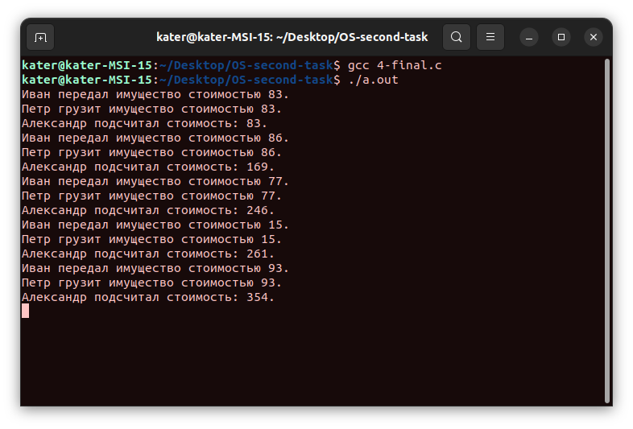

# Операционные системы. ИДЗ №1. Вариант 29.

#### Выполнил Старцев Евгений Борисович, БПИ219.

## Условие

Первая военная задача. Темной–темной ночью прапорщики Иванов, Петров и Нечепорук занимаются хищением военного имущества
со склада родной военной части. Будучи умными людьми и
отличниками боевой и строевой подготовки, прапорщики ввели разделение труда. Иванов выносит имущество со склада и
передает его в руки Петрову, который грузит его в грузовик. Нечепорук стоит на
шухере и заодно подсчитывает рыночную стоимость добычи после погрузки в грузовик очередной партии похищенного. Требуется
создать приложение, моделирующее деятельность прапорщиков. Время выполнения каждого действия прапорщиков - процессов
задавать случайным образом.

## Отчёт

Для того чтобы запустить программу, необходимо прописать следующие команды:

```c
gcc file.c
./a.out
```

где `file.c` - файл с кодом.

Работу выполнял на 6 баллов.

## Небольшое предисловие

Во время прочтения ИДЗ я понял, что тестовые данные конкретно для моего условия придумать сложно - с клавиатуры ничего
вводить не нужно, а задача состоит в моделировании процесса. Поэтому к каждому решению я прикрепил скриншот из
терминала, в котором демонстрируется, что программа работает и компилируется (а к программе на 6 даже видео). Но по
факту все программы работают абсолютно одинаково. Тут как у автомобилей - едут все почти одинаково, а вот как едут и что
под капотом - в этом главные отличия.

### Общие моменты решений

По факту каждая из программ отличается способом применения семафор. Также различаются стандарты.
В каждой из программ создаются семафоры и разделяемая память. В дальнейшем с помощью `fork` и цикла `for` создаются
три процесса - каждый из процессов отвечает за действия каждого из наших героев (Иванов, Петров, Нечепорук). В каждом
процессе запускаются методы, содержащие бесконечные циклы, в которых и моделируется (с помощью `printf`), что делает
тот или иной герой. Далее разделяемая память закрывается и удаляется, также удаляются семафоры.

### Решение на 4 балла.

Файл непосредственно с исходным кодом - [4-final.c](4-final.c).

Задания на 4 и на 5 баллов выполняются с применением стандарта POSIX - то есть, семафоры открываются с помощью
команды `sem_open`, закрываются и
удаляются с помощью команд `sem_close` и `sem_unlink`.



### Решение на 5 баллов.

Файл непосредственно с исходным кодом - [5-final.c](5-final.c).

По факту программы на 5 и на 4 балла отличаются только тем, что семафоры хранятся в разделяемой памяти (обновил
структуру `SharedData`, смотрите в строках 11-14). Также используются чуть другие команды - `sem_init` для
инициализации, `sem_destroy` для закрытия и удаления (то есть, уничтожения). Хот


### Решение на 6 баллов.

Файл непосредственно с исходным кодом - [6-final.c](6-final.c).

Решение на 6 довольно похоже на решение на оценку 4, только команды для работы с семафорами используются другого
стандарта - UNIX SYSTEM V (например, для открытия разделяемой памяти используется `shmget`, а не `shm_open`, и так далее
по списку).

[Видео работы](6-video.webm)

## Заключение

Надеюсь, всё понятно, всё работает и всё будет отлично :)